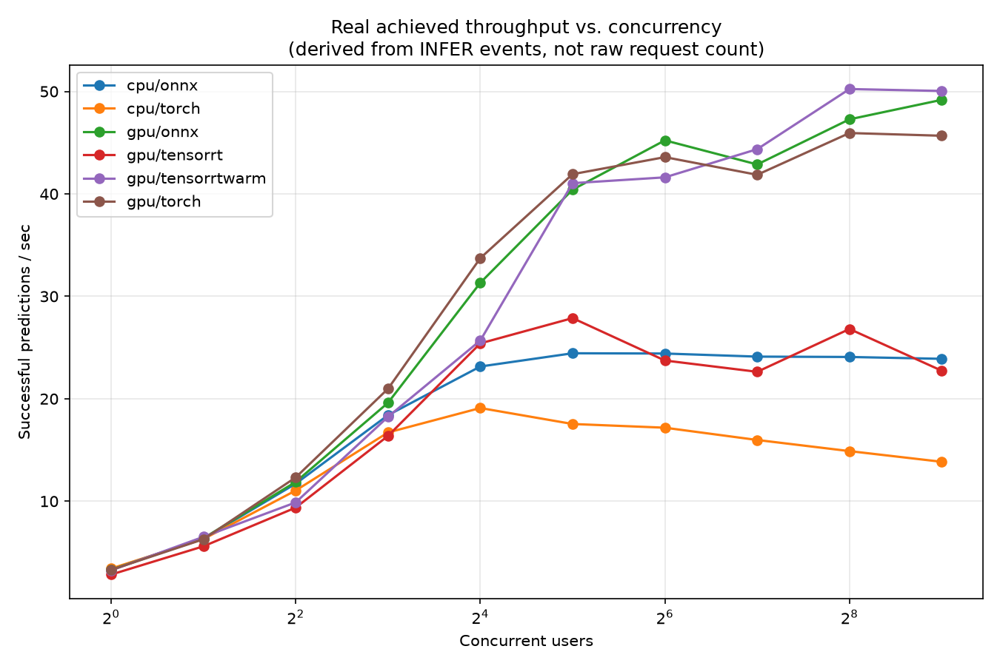
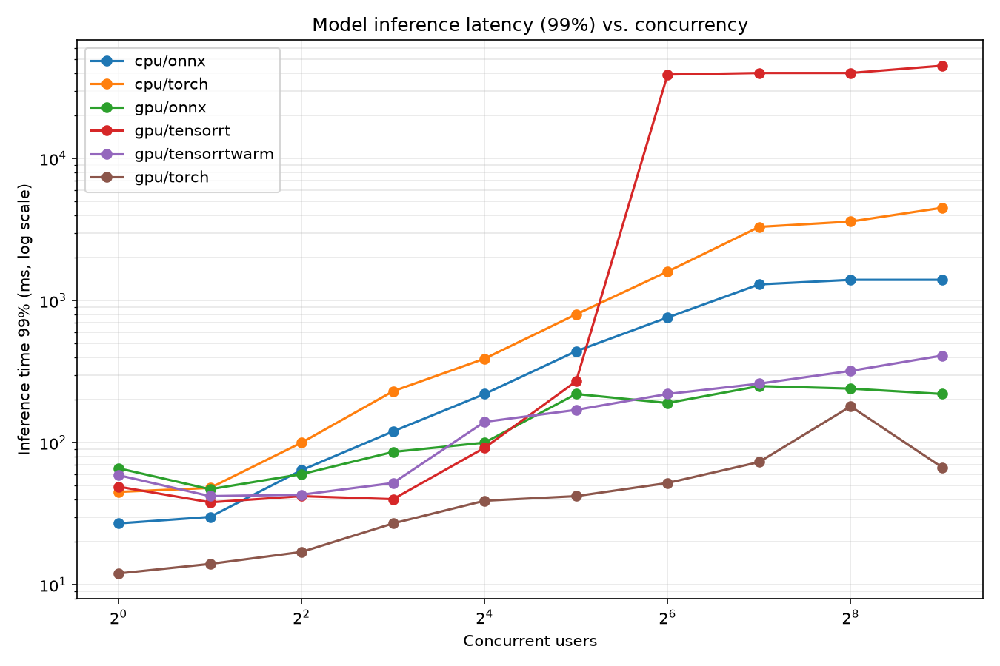
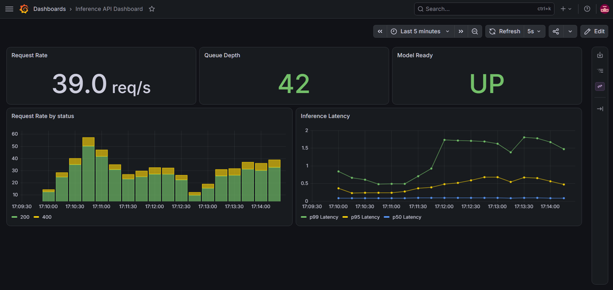
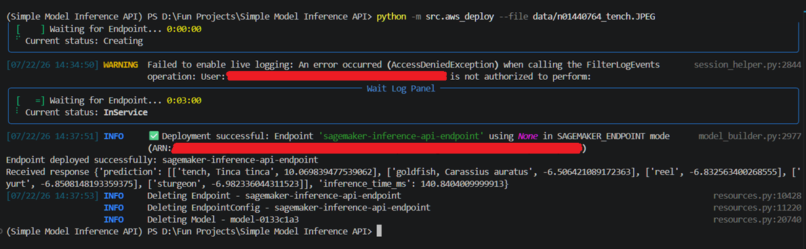

# Simple Model Inference API


A lightweight, production-oriented REST API for image classification, built around pre-trained Hugging Face models. It supports three interchangeable inference backends (PyTorch, ONNX Runtime, TensorRT), dynamic request batching, GPU and CPU deployment, and ships with load testing, Prometheus metrics, and a Grafana dashboard.

## Features

- **REST API**: FastAPI-based HTTP interface for image classification
- **Multiple inference backends**: PyTorch (eager), ONNX Runtime, and TensorRT (via ONNX Runtime's execution provider), selectable per deployment with no code changes
- **Dynamic batching**: Requests are queued and batched on a dedicated worker thread, with a configurable maximum batch size and timeout
- **Decoupled async-compute architecture**: compute-bound inference runs on a dedicated OS-level worker thread, isolating it from the async network I/O loop
- **Isolated batch failures**: a malformed input only fails its own request — it doesn't take down the rest of the batch it was queued with
- **Backpressure**: A bounded request queue rejects new work with `429` once saturated, rather than growing unbounded under load
- **Per-request timeout**: `INFERENCE_TIMEOUT` bounds how long a request will wait on the queue/worker before failing with `504`, independent of anything that can go wrong on the worker thread
- **Prometheus metrics**: Request counts/latency, inference latency, batch size distribution, queue depth, and rejection counts, exposed at `/metrics`
- **Grafana dashboard**: Provisioned out of the box via Docker Compose — see [Monitoring](#monitoring)
- **Load tested**: Locust-based load testing across all backends and a range of concurrency levels, with a script to turn the results into comparison graphs — see [Load Testing](#load-testing)
- **ONNX export tooling**: A script to export supported models to ONNX with a dynamic batch axis, including a torch-vs-ONNX parity check before anything ships
- **CI/CD**: GitHub Actions pipeline that runs the test suite, exports and validates the ONNX artifact, builds the Docker images, and smoke-tests both the PyTorch and ONNX backends in real containers before anything is considered green
- **GPU support**: CUDA-enabled builds for `torch`, `onnx`, and `tensorrt` backends, with automatic CPU fallback in the PyTorch backend if CUDA isn't available
- **Non-root container**: Runs as an unprivileged user; constant-time API key comparison to avoid timing attacks
- **Environment-based configuration**: Every runtime parameter is a validated environment variable, no code changes needed to reconfigure a deployment

## Architecture

```
src/
├── app.py               # FastAPI application: routes, request validation, auth, metrics middleware
├── config.py             # Environment-based configuration, with validation
├── inference_engine.py   # Queueing, dynamic batching, and the dedicated worker thread
├── model_manager.py      # ModelManager (ABC) + TorchModelManager / ONNXModelManager backends
└── metrics.py             # Prometheus metric definitions and the live queue-depth collector
```

Requests to `/predict` are validated (size, content type, dimensions) and enqueued onto a bounded, thread-safe queue. A single background worker thread continuously drains that queue, grouping items into batches (bounded by `MAX_BATCH_SIZE` and `BATCHING_TIMEOUT_MS`) and running them through whichever backend is configured. Preprocessing failures are isolated per-item; a batch-level failure (e.g. a backend error) fails only the requests that were actually part of that batch. Results are handed back to the original request's event loop via `call_soon_threadsafe`, with a caller-side `asyncio.wait_for` timeout (`INFERENCE_TIMEOUT`) as the backstop against a request never resolving.

`ModelManager` is an abstract base class; `preprocess_inputs` and `top_k_from_logits` are shared across backends, while `load_model` and `predict` are backend-specific. Adding a new backend means implementing those two methods and registering it in `InferenceBackendMapping` — the batching/queueing logic in `inference_engine.py` doesn't need to know which backend it's talking to.

## Prerequisites

- Python 3.12
- [uv](https://docs.astral.sh/uv/) for dependency management
- Docker + Docker Compose (for containerized runs)
- Optional: an NVIDIA GPU with CUDA 12.6 and the NVIDIA Container Toolkit, for GPU/TensorRT deployments

## Installation

### Local development

```bash
git clone <repository-url>
cd Simple-Model-Inference-API

# Pick exactly one of cpu/gpu — installing both is blocked, since they pull
# conflicting torch wheel variants from different package indices.
uv sync --extra cpu           # CPU-only, deployment deps
uv sync --extra gpu           # CUDA-enabled, deployment deps
uv sync --extra cpu --dev     # CPU-only, plus test/lint tooling
uv sync --extra gpu --dev     # CUDA-enabled, plus test/lint tooling

# Optional: only needed for scripts/plot_load_results.py
uv sync --group analysis
```

Create a `.env` for local configuration (optional — every setting has a sane default):
```bash
cp .env.template .env
# then edit .env, e.g.:
MODEL_NAME=microsoft/resnet-50
INFERENCE_DEVICE=cpu
INFERENCE_BACKEND=torch
LOG_LEVEL=INFO
```

### Docker

Build for CPU:
```bash
docker build -f docker/Dockerfile -t simple-model-inference-api:cpu .
```

Build for GPU (CUDA 12.6):
```bash
docker build -f docker/Dockerfile --build-arg EXTRA=gpu -t simple-model-inference-api:cu126 .
```

Run a built image directly:
```bash
docker run --env-file .env -p 8000:8000 simple-model-inference-api:cpu   # or :cu126
```

Run with Docker Compose (CPU, `onnx` backend by default):
```bash
docker compose -f docker/docker-compose.yml up --build
```

Run with Docker Compose (GPU — layers the GPU overrides on top of the base file):
```bash
docker compose -f docker/docker-compose.yml -f docker/docker-compose.gpu.yml up --build
```

The GPU compose file requires a `.onnx` artifact already present under `./onnx_models` if you're running the `onnx` or `tensorrt` backend — see [Exporting a model to ONNX](#exporting-a-model-to-onnx). The base compose file sets `INFERENCE_BACKEND=onnx`; override it via `.env` (`INFERENCE_BACKEND=torch`) to use the PyTorch backend instead, which downloads directly from the Hugging Face Hub and needs no exported artifact.

## Running the application

### Local (no Docker)

```bash
uv run python -m src.app
```
or
```bash
uv run uvicorn src.app:app --reload
```
The API is available at `http://localhost:8000`.

## Exporting a model to ONNX

The `onnx` and `tensorrt` backends load a pre-exported `.onnx` file rather than downloading weights at runtime. Export it once with:

```bash
uv sync --extra cpu   # export needs torch + transformers, regardless of the target backend
uv run python scripts/export_onnx.py
```

This reads `MODEL_NAME`/`MODEL_PATH`/`MAX_BATCH_SIZE` from your environment/`.env`, exports a dynamic-batch-axis ONNX graph (any batch size from 1 up to `MAX_BATCH_SIZE`, not a fixed shape), writes `<model_path>/<sanitized_model_name>.onnx` and a companion `<sanitized_model_name>_config.json` (carrying the model's `id2label`), and then runs a **parity check** — a real image through both the original PyTorch model and the freshly-exported ONNX graph, failing loudly (non-zero exit) if their top-1 predictions disagree. Skip the parity check for faster local iteration with `SKIP_PARITY_CHECK=true` — not recommended for an artifact you actually intend to deploy.

**TensorRT specifically**: the `tensorrt` backend builds and caches an optimized engine on first load (`onnx_models/tensorrtcache/`), keyed by the exact batch shape it encounters. An unwarmed cache means the *first* request pays a real, multi-second-to-tens-of-seconds compilation cost on the request path — see [Load Testing](#load-testing) for what that looks like under concurrent load, and why warming the cache across a representative range of batch sizes before serving real traffic matters.

## API Endpoints

### `GET /health/live`
Process-level liveness — is the ASGI server up and the worker thread alive. No model-loading dependency.
```json
{"status": "alive"}
```

### `GET /health/ready`
Is the model loaded and the request queue accepting work. Returns `503` if the model isn't loaded yet, the worker thread has died, the app is shutting down, or the queue is currently full.
```json
{"status": "ready"}
```

### `GET /health/startup`
Same health conditions as `/health/ready`, minus the queue-full check — intended for a Kubernetes-style startup probe.
```json
{"status": "ready"}
```

### `GET /info`
Requires `X-API-Key` if `API_KEY` is set.
```json
{"name": "microsoft/resnet-50", "device": "cuda", "model_path": null}
```

### `GET /metrics`
Prometheus text exposition format (not JSON) — scrape this with Prometheus rather than parsing it directly. See [Monitoring](#monitoring).

### `POST /predict`
Requires `X-API-Key` if `API_KEY` is set. `multipart/form-data` with a single `file` field.
```bash
curl -H "X-API-Key: YOUR_API_KEY_HERE" -X POST -F "file=@path/to/image.jpg" http://localhost:8000/predict
```
```json
{
  "prediction": [["tench, Tinca tinca", 10.07], ["goldfish, Carassius auratus", -6.51]],
  "inference_time_ms": 38.79
}
```
Possible error responses: `400` (invalid content type, unreadable image, or image dimensions over `MAX_IMAGE_DIMENSIONS`), `413` (file over `MAX_FILE_SIZE_MB`), `429` (queue full — check `Retry-After`), `504` (exceeded `INFERENCE_TIMEOUT` waiting for a result).

## Configuration

All configuration is via environment variables (or a `.env` file — see `.env.template`), validated at startup in `src/config.py`.

| Variable | Default | Description |
|---|---|---|
| `MODEL_NAME` | `microsoft/resnet-50` | One of `microsoft/resnet-50`, `google/mobilenet_v2_1.4_224`, `resnet-50`, `mobilenet_v2` |
| `MODEL_PATH` | `None` | Directory containing `<model_name>.onnx` + `_config.json`, for the `onnx`/`tensorrt` backends. Unused (downloads from the Hub) for `torch` |
| `INFERENCE_DEVICE` | `cuda` | `cpu` or `cuda` |
| `INFERENCE_BACKEND` | `torch` | `torch`, `onnx`, or `tensorrt` |
| `API_HOST` | `0.0.0.0` | Bind address |
| `API_KEY` | `None` | If set, required via `X-API-Key` header on `/predict` and `/info` |
| `API_PORT` | `8000` | Bind port |
| `DEBUG` | `false` | Debug logging |
| `LOG_LEVEL` | `INFO` | `DEBUG` / `INFO` / `WARNING` / `ERROR` / `CRITICAL` |
| `LOG_FORMAT` | `json` | `json` or `text` |
| `MAX_FILE_SIZE_MB` | `16` | Max upload size |
| `MAX_CHUNK_SIZE_MB` | `1` | Chunk size used when streaming the upload body (must be ≤ `MAX_FILE_SIZE_MB`) |
| `MAX_IMAGE_DIMENSIONS` | `4096,4096` | Max width,height after decoding |
| `MODEL_INPUT_SHAPE` | `None,3,224,224` | Expected model input tensor shape |
| `TOP_K_PREDICTIONS` | `5` | Predictions returned per request |
| `MAX_TOP_K_PREDICTIONS` | `10` | Upper bound on `TOP_K_PREDICTIONS` |
| `MAX_CONCURRENT_REQUESTS` | `256` | Bounded queue capacity — `429` once full |
| `MAX_BATCH_SIZE` | `64` | Max items per inference batch |
| `BATCHING_TIMEOUT_MS` | `3` | Max wait to fill a batch before dispatching a partial one |
| `API_RETRY` | `5` | `Retry-After` value (seconds) sent with a `429` |
| `INFERENCE_TIMEOUT` | `60` | Max seconds a request will wait for a result before `504` |

## Testing

```bash
pytest                                    # full suite
pytest --cov=src --cov=scripts --cov-report=term-missing   # with coverage
```

Test files, by area: `test_app.py` (API/HTTP layer), `test_config.py`, `test_inference_engine.py` (queueing/batching/threading), `test_model_manager.py` (both backends), `test_metrics.py`, `test_export_onnx.py`. External calls (Hugging Face Hub, ONNX Runtime sessions, `torch.onnx.export`) are mocked throughout — the suite needs no network access or real model weights to run.

## Load Testing

`tests/load/locustfile.py` drives `/predict` with a mix of valid images (weight 5) and deliberately invalid ones (weight 1, expecting `400`/`429`) — that intentional ~1-in-6 ratio matters when reading raw request-rate numbers, see below.

```bash
uv sync --group dev   # includes locust
locust -f tests/load/locustfile.py --host http://localhost:8000 \
  --users 128 --spawn-rate 10 --run-time 2m --headless \
  --csv=results/<platform>/<backend>/run_128users
```

**A methodological note, worth internalizing before reading any of the numbers below**: Locust's own aggregate `Requests/s` includes both the intentionally-invalid traffic and any `429` backpressure rejections (the locustfile correctly treats a `429` as an expected outcome, not a failure — but that means it still counts toward the raw request rate). At high concurrency this can make throughput look like it's *increasing* when the server is actually just rejecting more requests, faster. `scripts/plot_load_results.py` corrects for this by computing throughput from the custom `INFER` metric (fired only on an actual successful prediction), not the raw request count — that's the number to trust for cross-backend comparison.

### Generating the comparison graphs

```bash
uv sync --group analysis
python scripts/plot_load_results.py --results-dir results --output-dir results/plots
```

Auto-discovers every `results/<platform>/<backend>/run_<N>users_stats.csv`, so adding a new backend/platform combination needs no script changes — just drop its result files in and re-run. Produces, in `results/plots/`:

- `throughput_vs_concurrency.png`: Real achieved throughput (successful predictions/sec), the corrected metric described above
- `raw_post_rps_vs_concurrency.png`: The uncorrected Locust number, included for transparency/comparison
- `inference_latency_p95_vs_concurrency.png` / `_p99_vs_concurrency.png`: Pure model compute time, log scale
- `queueing_overhead_vs_concurrency.png` : Client-observed latency minus pure compute time, i.e. time spent waiting in the queue/batch
- `rejection_ratio_vs_concurrency.png` : % of requests without a successful prediction, with the expected ~16.7% baseline (from the locustfile's invalid-image task weight) marked for reference
- `peak_throughput_by_combo.png`: Bar chart summary
- `summary.csv` : one row per (backend, concurrency level), for anything not covered by the charts

### Results





Tested across `cpu/torch`, `cpu/onnx`, `gpu/torch`, `gpu/onnx`, `gpu/tensorrt` (cold engine cache), and `gpu/tensorrtwarm` (engine cache pre-warmed), at concurrency levels from 1 to 512 users. Key findings:

- **GPU roughly doubles CPU throughput** at saturation (~45–50 predictions/sec vs. ~24/sec for the best backend on each), a real but moderate gain for a model as small as ResNet-50 — not the order-of-magnitude some might expect.
- **`onnx` beats `torch` on CPU at every concurrency level past a handful of users**, and the gap widens with load: `torch`'s CPU throughput actively *degrades* past ~16 concurrent users (likely PyTorch's default intra-op thread pool contending with the batching worker thread for the same cores), while `onnx` stays essentially flat.
- **On GPU, `torch` and `onnx` are closely matched**, with `onnx` edging ahead specifically at the highest concurrency levels despite `torch` having better per-request latency — lower single-request latency didn't translate to higher sustained throughput here.
- **`tensorrt` is the best-performing GPU backend once its engine cache is warm** — matching or exceeding `onnx`/`torch` throughput with the lowest p99 latency of any backend. **With a cold cache, it's a different story**: p99 latency spikes into the tens of seconds under concurrent load, as the batching worker blocks mid-request to JIT-compile an engine for a batch shape it hasn't seen yet. The cold-vs-warm comparison here is a deliberate, kept data point — it's the actual cost of skipping cache warmup, not a bug.

## Monitoring

A Prometheus + Grafana stack ships as a Compose overlay, pre-provisioned with a data source and dashboard — no manual setup required.

```bash
docker compose -f docker/docker-compose.yml -f docker/docker-compose.monitoring.yml up -d
```
- Prometheus: `http://localhost:9090` (scrapes `/metrics` every 5s — see `monitoring/prometheus.yml`)
- Grafana: `http://localhost:3000` (`admin` / value of `GF_SECURITY_ADMIN_PASSWORD`), dashboard auto-loaded from `monitoring/grafana/provisioning/`



Dashboard panels: Total request Rate, request rate by status code, request/inference latency percentiles, live queue depth, and model-ready status. Queue depth is the most useful panel to watch during a load test — it's what would show a cold-cache TensorRT stall happening in real time, rather than reconstructing it afterward from CSV timestamps.

## CI/CD

`.github/workflows/ci.yml` runs on every push/PR:

1. **`test`** — Installs with `uv sync --extra cpu --dev`, runs the full test suite with coverage.
2. **`export-onnx`** — Exports the ONNX artifact (cached, keyed on `uv.lock` — only re-runs when pinned export dependencies actually change) and runs the parity check.
3. **`build`** — Builds the Docker image.
4. **`execute`** — Starts the built image in both `torch` and `onnx` configurations and smoke-tests each: confirms the expected inference dependency actually imported, then polls `/health/live` and `/health/ready` with real timeouts, dumping container logs on any failure. Gated behind a manual approval step — a deliberate choice to make "deploying an artifact" require an explicit human sign-off, not a rubber stamp.

## Docker deployment details

**Multi-stage build**: A `builder` stage resolves and installs dependencies via `uv sync` (cached across builds); the runtime stage copies only the resulting `.venv` and application code — no build toolchain in the final image.

**Backend selection at build time**: The `EXTRA` build arg (`cpu` or `gpu`) selects which `torch`/`onnxruntime` variant gets installed — `cpu` pulls genuinely CPU-only wheels from PyTorch's own index (not the default PyPI wheel, which requires CUDA libraries to even import); `gpu` pulls CUDA 12.6 wheels plus TensorRT.

**Security**: Runs as a non-root user (`modelapi`, uid 8888); `.dockerignore` keeps `.env`/`.git`/caches out of the build context and any image layer; API key comparison uses `hmac.compare_digest` to avoid timing attacks.

**Health check**: Container-level `HEALTHCHECK` polls `/health/live` (30s interval, 10s timeout, 40s start grace period, 3 retries) — reflects process liveness, not model-readiness; use `/health/ready` for a stronger signal if you're wiring up your own orchestrator probes.

## AWS Deployment

The docker image is compatible with the Build Your Own Container (BYOC) format and is deployable on AWS Sagemaker. Due to dependencies, sagemaker is assigned its own dependency group. The user needs to have appropriate AWS permissions to utilize Sagemaker. Here AmazonSageMakerFullAccess was used. Steps to deploy:

Create an S3 repository for holding ONNX models. Export the ONNX models and configurations generated via `scripts/export_onnx.py` to the S3 repo after packaging them into a tarball named `model.tar.gz`:
```bash
tar -czvf onnx_models/model.tar.gz \
          onnx_models/microsoft-resnet-50_config.json \
          onnx_models/microsoft-resnet-50.onnx \
          onnx_models/microsoft-resnet-50.onnx.data
aws s3 cp onnx_models/model.tar.gz s3://inference-sagemaker-bucket/onnx_models/model.tar.gz 
```

Create an ECR repository for holding the docker image. Build the docker image using Dockerfile.sagemaker and push it:
```bash
aws ecr create-repository --repository-name inference-sagemaker
docker buildx build --platform linux/amd64 --provenance=false --sbom=false \
       --output type=image,oci-mediatypes=false -f docker/Dockerfile.sagemaker \
       --build-arg EXTRA=cpu -t simple-model-inference-api:aws-cpu .
docker tag simple-model-inference-api:aws-cpu <aws_id>.dkr.ecr.<aws_region>.amazonaws.com/inference-sagemaker:aws-cpu
aws ecr get-login-password --region <aws_region> | docker login --username AWS --password-stdin <aws_id>.dkr.ecr.<aws_region>.amazonaws.com 
docker push <aws_id>.dkr.ecr.<aws_region>.amazonaws.com/inference-sagemaker:aws-cpu
```

Create .env.aws based on .env.aws.template and ensure all fields are filled with valid values. Switch to the sagemaker installation:
```bash
uv sync --extra aws
```

Deploy, test and delete the AWS endpoint with `scripts/aws_deploy.py`:


## Project structure

```
.
├── src/
│   ├── __init__.py
│   ├── app.py                    # FastAPI app: routes, auth, metrics middleware
│   ├── config.py                 # Environment-based configuration + validation
│   ├── inference_engine.py       # Queueing, dynamic batching, worker thread
│   ├── metrics.py                # Prometheus metric definitions
│   └── model_manager.py          # ModelManager ABC + Torch/ONNX backend implementations
├── scripts/
│   ├── export_onnx.py            # Export + parity-check a model to ONNX
|   ├── aws_deploy.py             # Deploy docker image in AWS and test prediction
│   └── plot_load_results.py      # Parse Locust CSVs into comparison graphs
├── tests/
│   ├── load/
│   │   └── locustfile.py         # Load testing scenarios
│   ├── test_app.py
│   ├── test_config.py
│   ├── test_export_onnx.py
│   ├── test_inference_engine.py
│   ├── test_metrics.py
│   └── test_model_manager.py
├── docker/
│   ├── Dockerfile
│   ├── docker-compose.yml            # CPU / onnx by default
│   ├── docker-compose.gpu.yml        # GPU override
│   └── docker-compose.monitoring.yml # Prometheus + Grafana overlay
├── monitoring/
│   ├── prometheus.yml
│   └── grafana/provisioning/         # Data source + dashboard, auto-loaded
├── results/
│   ├── <platform>/<backend>/         # Raw Locust CSVs per run
│   ├── plots/                        # Generated comparison graphs + summary.csv
│   └── monitoring/                   # Grafana dashboard screenshot
├── .github/workflows/ci.yml
├── pyproject.toml
├── uv.lock
├── .env.template
└── README.md
```
